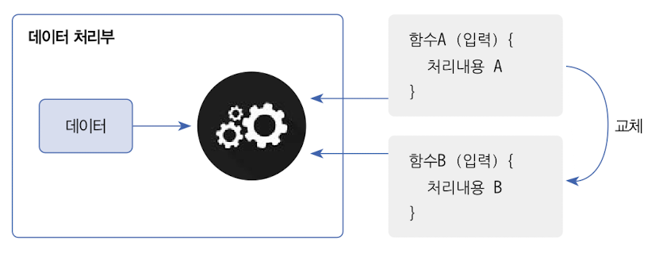
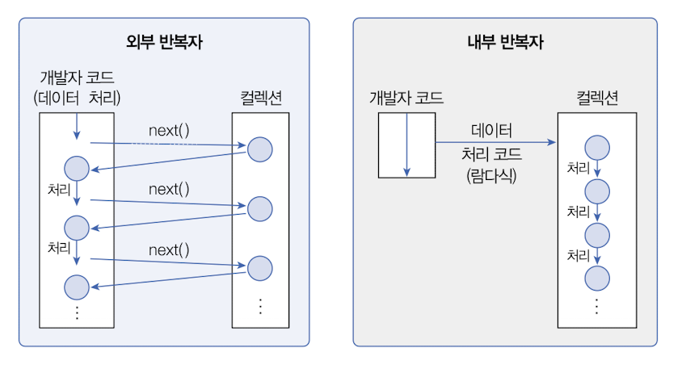
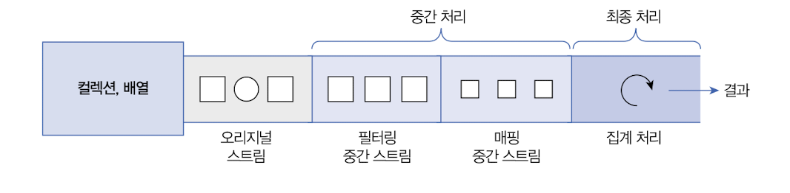

# 람다식과 스트림

### 람다식: *Lambda Expression*

---

#### 함수형 프로그래밍

코드를 처리하는 데이터 처리부에 데이터만 존재한다고 했을 때, 외부에서 제공하는 함수에 따라 데이터를 처리하는 기법을 함수형 프로그래밍이라고 합니다. 동일한 데이터를 데이터 처리부가 지니고 있다고 하더라도, 제공받는 함수에 따라 처리되는 결과가 달라질 수 있습니다.



즉 기존과 같이 데이터를 함수에 전달하는 것이 아니라, 데이터에 함수를 전달하는 것을 함수형 프로그래밍, 데이터 처리의 다형성이라고 합니다.

Java 8의 람다식은 위 그림과 같이 데이터 처리부에 제공되는 함수 역할을 하는 중괄호 블록입니다.
```java
람다식: (매개변수, ...) -> {처리 내용}
```

#### Java에서 람다식의 동작 방식

우선 다음과 같은 Calculable 인터페이스가 있다고 가정해 보겠습니다.

```java
public interface Calculable {
  void calculate(int x, int y);
}
```

그리고 다음과 같이 Calculable 타입의 객체를 매개변수로 받는 하나의 action 메소드가 있다고 가정해 보겠습니다.

```java
public void action(Calculable calculable) {
  int x = 10;
  int y = 4;
  calculable.calculate(x, y)
}
```

원래대로라면 Calculable을 구현하는 클래스와 객체를 생성하고 action 메소드를 호출할 때 매개변수로 해당 객체를 전달해야 하지만, 람다를 이용하면 클래스를 구현하지 않아도 다음과 같이 action 메소드를 호출할 수 있습니다.

```java
// 람다식1
action( (x, y) -> {
  int result = x + y;
  System.out.println(result);
});

// 람다식2
action( (x, y) -> {
  int result = x - y;
  System.out.println(result);
});
```
하지만 람다식은 위의 Calculable 인터페이스 처럼 추상 메소드가 하나일 때만 표현이 가능합니다. 이러한 인터페이스를 함수형 인터페이스라고 하며, 작성할 때 @FunctionalInterface 어노테이션을 붙혀줍니다.

#### 실습
* Calculable.java
  
```java
@FunctionalInterface
public interface Calculable {
    // 추상 메소드
    void calculate(int x, int y);
}
```

* LambdaExample.java
```java
public class LambdaExample {
    public static void action(Calculable calculable) {
        // 데이터
        int x = 10;
        int y = 4;

        // 데이터 처리
        calculable.calculate(x, y);
    }

    public static void main(String[] args) {
        // 람다식1
        action(((x, y) -> {
            int result = x + y;
            System.out.println("result: " + result);
        }));

        // 람다식2
        action((x, y) -> {
            int result = x - y;
            System.out.println("result: " + result);
        });
    }
}

```

#### 람다식의 또다른 표현 방식
* **메소드 참조**: 메소드를 참조해서 람다식에서 불필요한 매개변수를 제거하는 표현 방식
```java
// 기존 방식
(left, right) -> Math.max(left, right);

// 메소드 참조
Math :: max
```
* **매개변수의 메소드 참조**: 다음과 같이 a라는 객체의 메소드 매개변수로 b를 활용할 때 사용된다.
```java
// 기존 방식
(a, b) -> { a.method1(b); }

// 축약 방식
a의 클래스 :: method1
```

* **생성자 참조**: 람다식이 단순히 객체를 생성하고 리턴하도록 구성된다면 람다식을 생성자 참조로 대치할 수 있다.
```java
// 기존 방식
(a, b) -> { return new 클래스(a, b); }

// 축약 방식
클래스 :: new
```


### 스트림 요소 처리

---

#### 개념

앞서 컬렉션에서 설명했던 HashMap의 코드를 살펴보겠습니다.
```java
import java.util.*;

public class HashMapExample {
    public static void main(String[] args) {
        // Map 컬렉션 생성
        Map<String, Integer> map = new HashMap<>();

        map.put("오동재", 4);
        map.put("조서윤", 1);
        map.put("한장수", 1);
        map.put("정다연", 4);
        System.out.println("총 조지미 수: " + map.size());
        System.out.println();

        String key = "한장수";
        int value = map.get(key);
        System.out.println("이름:" + key + " 학년:" + value);
        System.out.println();

        // 요소 반복 처리
        Set<String> keySet = map.keySet();
        for (String name : keySet) {
            int v = map.get(name);
            System.out.println(name + " : " + v);
        }
        System.out.println();

        // 키로 엔트리 삭제
        map.remove("한장수");
        System.out.println("총 조지미 수: " + map.size());
        System.out.println();
    }
}

```
Map에 저장된 요소를 반복 조회하기 위해 for문을 이용하여 요소를 하나씩 꺼내보았습니다. Java 8부터는 또 다른 방법으로 요소를 반복 처리하기 위해 **스트림**을 사용할 수 있게 되었습니다.

실습을 통해 어떤 방식으로 동작하는지 확인해 보겠습니다. 우선 chap04에서 다음과 같이 for문 부분을 주석 처리하고 stream을 이용해서 다시 작성해보겠습니다. 이때 Stream 클래스를 활용하기 위해서는 다음과 같이 stream 패키지 하위 클래스를 모두 import 해주어야 합니다.

* HashMapExample.java
```java
import java.util.*;
import java.util.stream.*;

public class HashMapExample {
    public static void main(String[] args) {
        // Map 컬렉션 생성
        Map<String, Integer> map = new HashMap<>();

        map.put("오동재", 4);
        map.put("조서윤", 1);
        map.put("한장수", 1);
        map.put("정다연", 4);
        System.out.println("총 조지미 수: " + map.size());
        System.out.println();

        String key = "한장수";
        int value = map.get(key);
        System.out.println("이름:" + key + " 학년:" + value);
        System.out.println();

        Set<String> keySet = map.keySet();
//        for (String name : keySet) {
//            int v = map.get(name);
//            System.out.println(name + " : " + v);
//        }
        Stream<String> stream = keySet.stream();
        stream.forEach(name -> {
            int v = map.get(name);
            System.out.println(name + " : " + v);
        });
        System.out.println();

        // 키로 엔트리 삭제
        map.remove("한장수");
        System.out.println("총 조지미 수: " + map.size());
        System.out.println();
    }
}

```
for문을 통한 요소 처리와 stream을 통한 요소 처리의 차이점은 for문은 외부 반복자라는 점이고 stream은 내부 반복자라는 점입니다. for문은 외부 반복자이기 때문에 컬렉션의 요소를 외부로 가져오는 코드와 처리하는 코드를 모두 개발자가 작성한 코드에 포함이 되어있어야 하는 반면에, 람다식을 컬렉션에 전달하면 컬렉션 내부에서 요소를 반복 처리합니다.


#### Stream 파이프라인

스트림은 하나 이상 연결 될 수 있습니다. 다음과 같이 중간에 필터링 스트림과 매핑 스트림이 연결될 수 있고 최종적으로 평균, 합계 등을 구하는 최종 처리를 진행합니다.
> ⚠️ 최초 스트림부터 중간 스트림까지 모두 작동하기 위해서는 파이프라인 끝 부분에 최종 스트림이 반드시 존재해야 합니다.



#### 실습
* Student.java
```java
public class Student {
    public String studentName;
    public int studentAge;

    public Student(String studentName, int studentAge) {
        this.studentName = studentName;
        this.studentAge = studentAge;
    }
}
```

* StreamPipeLineExample.java
```java
import java.util.*;

public class StreamPipeLineExample {
    public static void main(String[] args) {
        List<Student> list = new ArrayList<Student>();

        list.add(new Student("오동재", 26));
        list.add(new Student("김신희", 25));
        list.add(new Student("주영빈", 24));
        list.add(new Student("안준영", 24));
        list.add(new Student("최기웅", 24));

        // 메소드 체이닝 기법
        double avg = list.stream()
                .mapToDouble(student -> student.studentAge)
                .average()
                .orElseThrow(NoSuchElementException::new);

        System.out.println("운영진 평균 나이: " + avg);
    }
}


```

* 메소드 체이닝 기법을 통해 간결하게 코드를 작성할 수 있습니다.
* 위 코드에서 최종 처리인 average()가 없다면 stream(), mapToDouble() 과 같은 중간 처리는 동작하지 않습니다.
* orElseThrow()는 예외 처리 코드입니다. Optional 타입에 대해 기회가 된다면 더 자세하게 설명하겠습니다.