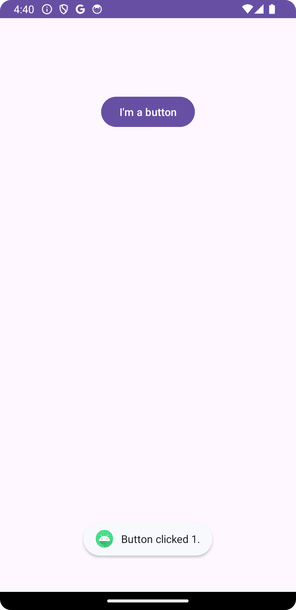
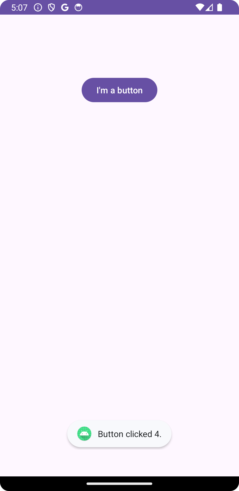

# 버튼의 이벤트를 처리하는 4가지 방식

## 0. 개요

* 1)XML에서 이벤트 처리 메소드 등록
* 2)내부 클래스 사용하는 방식
* 3)익명 내부 클래스 사용하는 방식
* 4)람다 표현식 (Lambda Expression) 사용하는 방식
* etc)Activity에서 View.OnClickListener 인터페이스를 직접 구현

## 1. XML에서 이벤트 처리 메소드 등록

사용자가 버튼을 클릭할 때 발생하는 클릭 이벤트를 처리하기 위해 **XML 레이아웃 파일에 이벤트 처리 메소드**를 등록하는 방법이 가장 기본이다. 이벤트가 발생했을 때 등록된 메소드가 호출되기 위해서는 다음과 같이 `<Button>` 요소에 `onClick` 속성을 추가하고 호출하고자 하는 메소드를 등록한다. 

<br>

```xml
<?xml version="1.0" encoding="utf-8"?>
<androidx.constraintlayout.widget.ConstraintLayout xmlns:android="http://schemas.android.com/apk/res/android"
    xmlns:app="http://schemas.android.com/apk/res-auto"
    xmlns:tools="http://schemas.android.com/tools"
    android:layout_width="match_parent"
    android:layout_height="match_parent"
    tools:context=".MainActivity">

    <Button
        android:id="@+id/btNormal"
        android:layout_width="wrap_content"
        android:layout_height="wrap_content"
        android:text="I'm a button"
        android:onClick="handleButtonClick"
        app:layout_constraintTop_toTopOf="parent"
        app:layout_constraintStart_toStartOf="parent"
        app:layout_constraintEnd_toEndOf="parent"
        android:layout_marginTop="100dp"
        tools:ignore="MissingConstraints" />

</androidx.constraintlayout.widget.ConstraintLayout>

```

<br>

메소드는 액티비티가 버튼을 가지고 있는 액티비티가 구현해야 한다. 여기서는 `MainActivity.java`에서 이를 구현한다.

<br>

```java
package com.example.hello;

import android.os.Bundle;
import android.view.View;
import android.widget.Toast;

import androidx.appcompat.app.AppCompatActivity;

public class MainActivity extends AppCompatActivity {

    @Override
    protected void onCreate(Bundle savedInstanceState) {
        super.onCreate(savedInstanceState);
        setContentView(R.layout.activity_main);
    }

    // onClick 속성에 지정된 메소드
    public void handleButtonClick(View view) {
        Toast.makeText(this, "Button clicked 1", Toast.LENGTH_SHORT).show();
    }
}
```

<br>

<p style="text-align:center;"></p>

<br>

## 2. 내부 클래스 사용

해당 방법은 `setOnClickListener()` 메소드를 사용하여 이벤트 리스너를 정의한다. XML 파일 내용을 수정하지 않고 java 코드에서만 처리할 수 있다.

<br>

```java
package com.example.hello;

import android.os.Bundle;
import android.view.View;
import android.widget.Button;
import android.widget.Toast;

import androidx.appcompat.app.AppCompatActivity;

public class MainActivity extends AppCompatActivity {

    @Override
    protected void onCreate(Bundle savedInstanceState) {
        super.onCreate(savedInstanceState);
        setContentView(R.layout.activity_main);

        Button btnormal = findViewById(R.id.btNormal);
        btnormal.setOnClickListener(new ButtonClickListener());
    }

    class ButtonClickListener implements View.OnClickListener {
        @Override
        public void onClick(View v) {
            Toast.makeText(getApplicationContext(), "Button clicked 2.", Toast.LENGTH_SHORT).show();
        }
    }
}
```
<p style="text-align:center;"></p>

<br>

## 3. 익명 내부 클래스 사용

2번 방식과 동일하지만 익명 내부 클래스를 이용하여 코드를 더 간결하게 만들 수 있다. `setOnClickListener()`의 파라미터로 익명 클래스의 객체를 생성한다.

<br>

```java
package com.example.hello;

import android.os.Bundle;
import android.view.View;
import android.widget.Button;
import android.widget.Toast;

import androidx.appcompat.app.AppCompatActivity;

public class MainActivity extends AppCompatActivity {

    @Override
    protected void onCreate(Bundle savedInstanceState) {
        super.onCreate(savedInstanceState);
        setContentView(R.layout.activity_main);

        Button btnormal = findViewById(R.id.btNormal);
        btnormal.setOnClickListener(new View.OnClickListener() {
            @Override
            public void onClick(View v) {
                Toast.makeText(getApplicationContext(), "Button clicked 3.", Toast.LENGTH_SHORT).show();
            }
        });
    }
}
```

<br>

<p style="text-align:center;"></p>

<br>

## 4. 람다 표현식 (Lambda Expression) 사용

2번, 3번 방식과 같은 맥락의 방식이지만 Java 8부터 지원하는 람다식을 활용하여 코드를 더 간결하게 처리할 수 있다. 객체를 생성하여 파라미터로 전달하는 방식이 아닌 함수를 전달한다.

<br>

```java
package com.example.hello;

import android.os.Bundle;
import android.widget.Button;
import android.widget.Toast;

import androidx.appcompat.app.AppCompatActivity;

public class MainActivity extends AppCompatActivity {

    @Override
    protected void onCreate(Bundle savedInstanceState) {
        super.onCreate(savedInstanceState);
        setContentView(R.layout.activity_main);

        Button btnormal = findViewById(R.id.btNormal);
        btnormal.setOnClickListener(v ->
                Toast.makeText(getApplicationContext(), "Button clicked 4.", Toast.LENGTH_SHORT).show()
        );
    }
}
```

<br>

<p style="text-align:center;"></p>

<br>

## etc. Activity에서 View.OnClickListener 인터페이스를 직접 구현

MainActivity 또는 Fragment에서 View.OnClickListener를 구현하고, 
각 버튼에 대해 `setOnClickListener(this)`를 호출하고, `onClick()` 메소드 안에서 분기 처리할 수도 있다.

<br>

```java
package com.example.hello;

import android.os.Bundle;
import android.view.View;
import android.widget.Button;
import android.widget.Toast;

import androidx.appcompat.app.AppCompatActivity;

public class MainActivity extends AppCompatActivity implements View.OnClickListener {

    @Override
    protected void onCreate(Bundle savedInstanceState) {
        super.onCreate(savedInstanceState);
        setContentView(R.layout.activity_main);

        Button btNormal = findViewById(R.id.btNormal);
        Button btNormalWithIcon = findViewById(R.id.btNormalWithIcon);

        btNormal.setOnClickListener(this);
        btNormalWithIcon.setOnClickListener(this);
    }

    @Override
    public void onClick(View v) {
        if (v.getId() == R.id.btNormal) {
            Toast.makeText(this, "btNormal clicked!", Toast.LENGTH_SHORT).show();
        }

        if (v.getId() == R.id.btNormalWithIcon) {
            Toast.makeText(this, "btNormalWithIcon clicked!", Toast.LENGTH_SHORT).show();
        }
    }
}
```

<p style="text-align:center;"></p>
