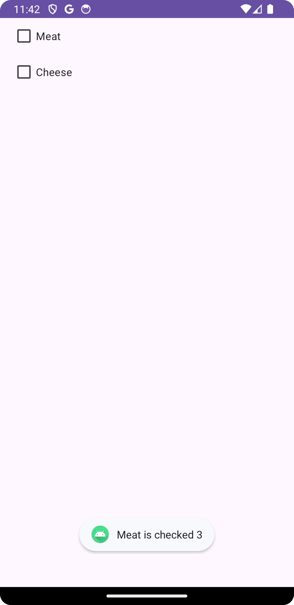
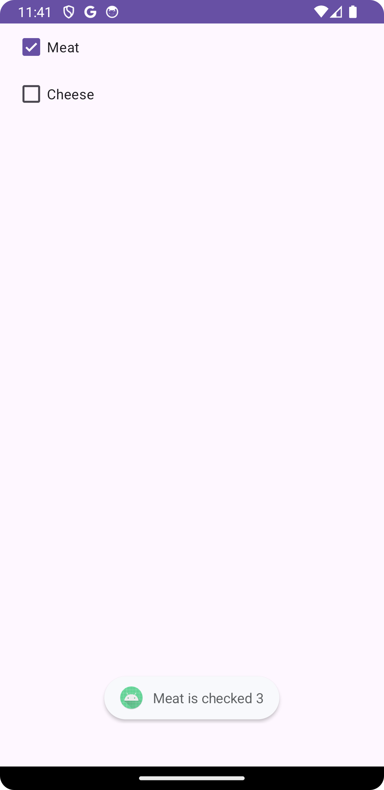

# CheckBox Test

## 1. 소스코드 분석

### 1.1 OnCheckedChangeListener 사용 방식

이 방식은 CheckBox의 체크 상태가 변경될 때마다 해당 이벤트를 감지해 처리합니다.

```java
package cse.mobile.chceckboxtest;

import android.os.Bundle;
import android.widget.CheckBox;
import android.widget.CompoundButton;
import android.widget.Toast;

import androidx.appcompat.app.AppCompatActivity;

public class MainActivity extends AppCompatActivity {

    @Override
    protected void onCreate(Bundle savedInstanceState) {
        super.onCreate(savedInstanceState);
        setContentView(R.layout.activity_main);

        // Meat 체크박스에 대해 체크 상태가 변경될 때 이벤트 처리
        CheckBox cbMeat = findViewById(R.id.cbMeat);
        cbMeat.setOnCheckedChangeListener(new CompoundButton.OnCheckedChangeListener() {
            @Override
            public void onCheckedChanged(CompoundButton buttonView, boolean isChecked) {
                if(isChecked) {
                    Toast.makeText(getApplicationContext(), "Meat is checked", Toast.LENGTH_SHORT).show();
                } else {
                    Toast.makeText(getApplicationContext(), "Meat is unchecked", Toast.LENGTH_SHORT).show();
                }
            }
        });

        // Cheese 체크박스에 대해 체크 상태가 변경될 때 이벤트 처리
        CheckBox cbCheese = findViewById(R.id.cbCheese);
        cbCheese.setOnCheckedChangeListener(new CompoundButton.OnCheckedChangeListener() {
            @Override
            public void onCheckedChanged(CompoundButton buttonView, boolean isChecked) {
                if(isChecked) {
                    Toast.makeText(getApplicationContext(), "Cheese is checked", Toast.LENGTH_SHORT).show();
                } else {
                    Toast.makeText(getApplicationContext(), "Cheese is unchecked", Toast.LENGTH_SHORT).show();
                }
            }
        });
    }
}
```

### 1.2 OnClickListener 사용 방식

이 방식은 CheckBox가 클릭될 때마다 이벤트를 감지해 처리합니다. 체크 상태는 isChecked() 메서드를 사용하여 확인합니다.

```java
package cse.mobile.chceckboxtest;

import android.os.Bundle;
import android.view.View;
import android.widget.CheckBox;
import android.widget.Toast;

import androidx.appcompat.app.AppCompatActivity;

public class MainActivity extends AppCompatActivity {

    @Override
    protected void onCreate(Bundle savedInstanceState) {
        super.onCreate(savedInstanceState);
        setContentView(R.layout.activity_main);

        // Meat 체크박스에 대한 클릭 이벤트 처리
        CheckBox cbMeat = findViewById(R.id.cbMeat);
        cbMeat.setOnClickListener(cbClickListener);

        // Cheese 체크박스에 대한 클릭 이벤트 처리
        CheckBox cbCheese = findViewById(R.id.cbCheese);
        cbCheese.setOnClickListener(cbClickListener);
    }

    // 공통 클릭 리스너: 체크박스가 클릭될 때마다 호출됨
    View.OnClickListener cbClickListener = new View.OnClickListener() {
        @Override
        public void onClick(View v) {
            boolean checked = ((CheckBox) v).isChecked();  // 체크 상태 확인

            int viewId = v.getId();
            if (viewId == R.id.cbMeat) {
                if (checked) {
                    Toast.makeText(getApplicationContext(), "Meat is checked", Toast.LENGTH_SHORT).show();
                } else {
                    Toast.makeText(getApplicationContext(), "Meat is unchecked", Toast.LENGTH_SHORT).show();
                }
            } else if (viewId == R.id.cbCheese) {
                if (checked) {
                    Toast.makeText(getApplicationContext(), "Cheese is checked", Toast.LENGTH_SHORT).show();
                } else {
                    Toast.makeText(getApplicationContext(), "Cheese is unchecked", Toast.LENGTH_SHORT).show();
                }
            }
        }
    };
}

```

### 1.3 정리

**OnCheckedChangeListener**

사용자가 체크박스의 상태를 바꿀 때마다 해당 변경을 감지하고 이벤트를 처리할 수 있습니다. 상태가 바뀌는 즉시 반응하는 방식입니다.
상태 변경이 중요한 경우(체크 여부에 따라 실시간으로 기능이 달라져야 하는 경우) 유용합니다.

**OnClickListener**

체크박스를 클릭할 때마다 동작합니다. 체크 상태는 클릭 후에 확인하여 처리합니다.
클릭 동작 자체가 중요한 경우(상태와 상관없이 클릭이 중요한 경우) 유용합니다.

## 2. 결과 화면

<p style="text-align:center;"></p>
<p style="text-align:center;"></p>
