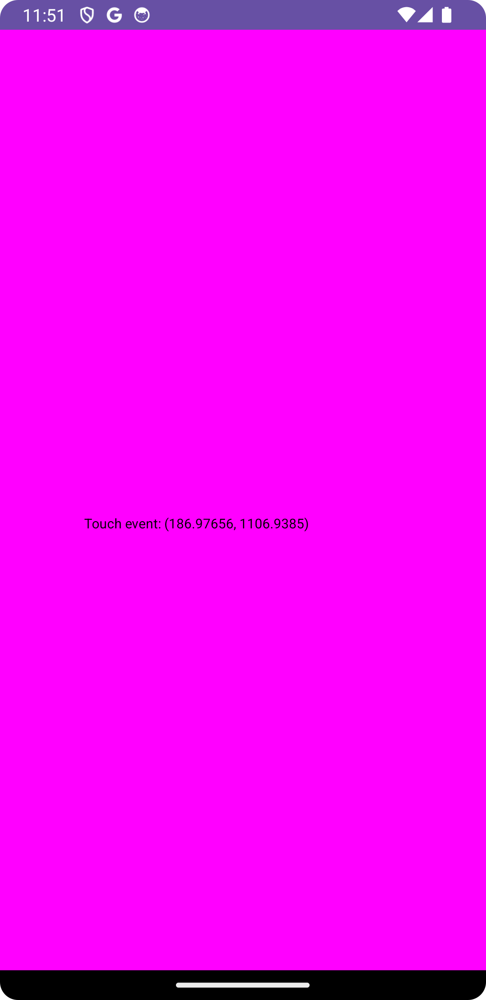

# MyView Test

## 1. 소스 코드 분석

### 1.2 MyView.java

```java
package cse.mobile.myviewtest;

import android.content.Context;
import android.graphics.Canvas;
import android.graphics.Color;
import android.graphics.Paint;
import android.util.AttributeSet;
import android.view.MotionEvent;
import android.view.View;

import androidx.annotation.NonNull;
import androidx.annotation.Nullable;

public class MyView extends View {
    float posX;  // 터치된 X 좌표
    float posY;  // 터치된 Y 좌표
    Paint paint = new Paint();  // 화면에 텍스트를 그리기 위한 Paint 객체

    // MyView 클래스의 생성자. XML 레이아웃 파일에서 뷰를 사용할 때 호출됨.
    public MyView(Context context, @Nullable AttributeSet attrs) {
        super(context, attrs);
        initView();  // 초기 설정을 위한 메서드 호출
    }

    // MyView 클래스의 생성자. 코드에서 직접 뷰를 생성할 때 호출됨.
    public MyView(Context context) {
        super(context);
        initView();  // 초기 설정을 위한 메서드 호출
    }

    // 초기 설정 메서드
    private void initView() {
        setBackgroundColor(Color.MAGENTA);  // 배경색을 마젠타로 설정
        paint.setTextSize(30);  // 그릴 텍스트의 크기를 30으로 설정
    }

    // onDraw는 화면을 그리는 메서드로, 뷰가 갱신될 때마다 호출됨.
    @Override
    protected void onDraw(@NonNull Canvas canvas) {
        super.onDraw(canvas);
        // 화면에 터치된 좌표를 텍스트로 출력
        canvas.drawText("Touch event: (" + posX + ", " + posY + ")", posX, posY, paint);
    }

    // 터치 이벤트가 발생했을 때 호출됨
    @Override
    public boolean onTouchEvent(MotionEvent event) {
        // 터치된 좌표를 저장
        posX = event.getX();
        posY = event.getY();
        invalidate();  // 화면을 다시 그리도록 요청 (onDraw 호출됨)

        // 터치 이벤트가 처리되었음을 나타내기 위해 true 반환
        return true;
    }
}
```

* MyView 클래스는 View 클래스를 상속받아 커스텀 뷰를 정의합니다.
* initView() 메서드는 배경색을 마젠타로 설정하고, 텍스트 크기를 30으로 설정합니다.
* onDraw() 메서드는 화면에 텍스트를 그리는데, 텍스트 내용은 터치된 위치를 나타냅니다.
* onTouchEvent()는 터치 이벤트를 처리하며, 터치된 좌표를 받아서 뷰를 갱신하기 위해 invalidate()를 호출합니다. 이를 통해 화면이 다시 그려지게 되고, 터치된 좌표가 텍스트로 출력됩니다.

### 1.3 MainActivity.java

```java

package cse.mobile.myviewtest;

import android.os.Bundle;

import androidx.activity.EdgeToEdge;
import androidx.appcompat.app.AppCompatActivity;
import androidx.core.graphics.Insets;
import androidx.core.view.ViewCompat;
import androidx.core.view.WindowInsetsCompat;

public class MainActivity extends AppCompatActivity {

    @Override
    protected void onCreate(Bundle savedInstanceState) {
        super.onCreate(savedInstanceState);
        setContentView(R.layout.activity_main);  // XML 레이아웃을 설정

        // MyView 인스턴스를 생성하고 화면에 설정
        MyView myView = new MyView(this);
        setContentView(myView);  // activity_main 대신 MyView가 화면에 표시됨
    }
}
```

* MainActivity는 AppCompatActivity를 상속받아 기본적인 액티비티의 기능을 수행합니다.
* onCreate() 메서드는 액티비티가 생성될 때 호출되며, 여기서 화면에 보여줄 뷰를 설정합니다.
* 처음에는 activity_main.xml 레이아웃 파일을 화면에 설정하지만, 이후 MyView라는 커스텀 뷰 객체를 생성하여 해당 뷰를 화면에 표시하도록 변경합니다. 따라서 activity_main 레이아웃 대신 MyView가 최종적으로 화면에 출력됩니다.

## 2. 결과 화면

<p style="text-align:center;"></p>