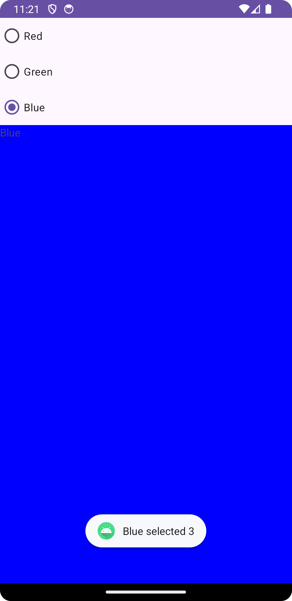
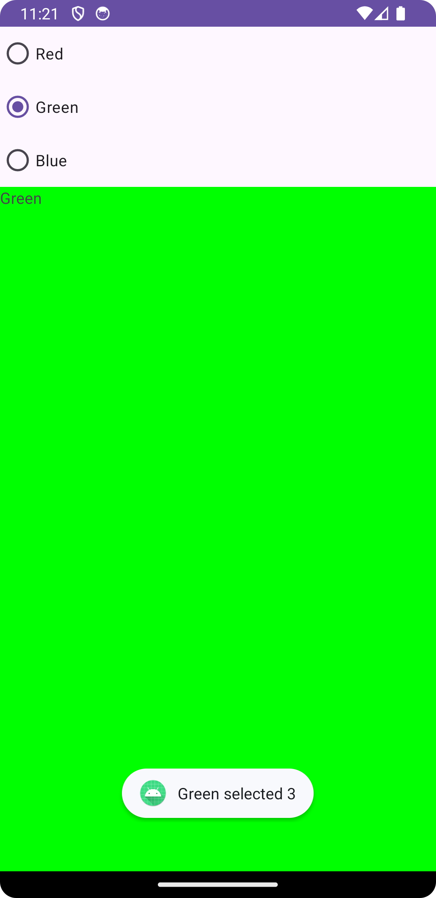
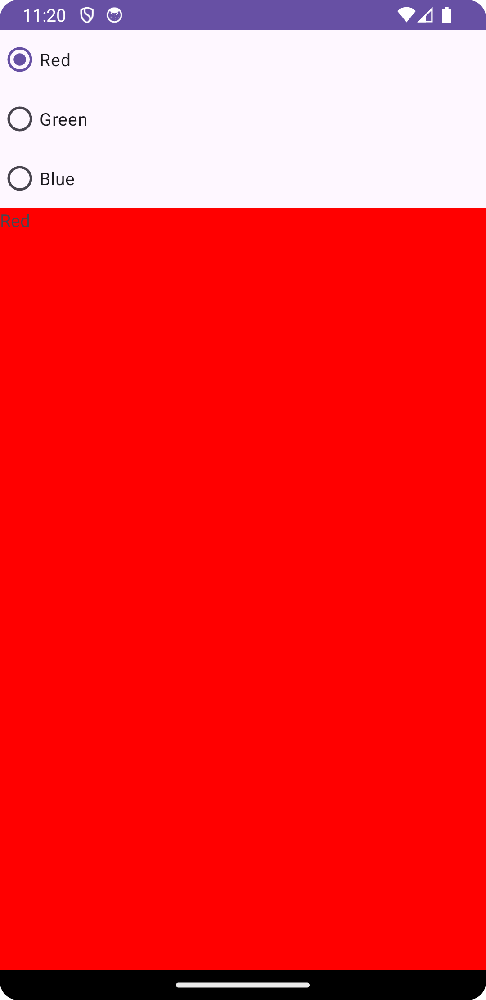

# RadioButton Test

## 1. 소스코드 분석

### 1.1 rbClickListener 활용

```java
package cse.mobile.radiobuttontest;

import android.os.Bundle;
import android.view.View;
import android.widget.RadioButton;
import android.widget.TextView;
import android.widget.Toast;

import androidx.appcompat.app.AppCompatActivity;

public class MainActivity extends AppCompatActivity {

    @Override
    protected void onCreate(Bundle savedInstanceState) {
        super.onCreate(savedInstanceState);
        setContentView(R.layout.activity_main);  // 레이아웃 파일 설정

        // 레이아웃에서 RadioButton 및 TextView 요소를 가져옴
        RadioButton rbRed = findViewById(R.id.rbRed);
        RadioButton rbGreen = findViewById(R.id.rbGreen);
        RadioButton rbBlue = findViewById(R.id.rbBlue);

        TextView tvRed = findViewById(R.id.tvRed);
        TextView tvGreen = findViewById(R.id.tvGreen);
        TextView tvBlue = findViewById(R.id.tvBlue);

        // 공통 클릭 리스너 정의
        View.OnClickListener rbClickListener = new View.OnClickListener() {
            @Override
            public void onClick(View v) {
                boolean checked = ((RadioButton) v).isChecked();  // 클릭된 RadioButton이 선택된 상태인지 확인

                int viewId = v.getId();  // 클릭된 RadioButton의 ID 확인
                if (viewId == R.id.rbRed) {
                    if (checked) {
                        Toast.makeText(getApplicationContext(), ((RadioButton) v).getText() + " selected", Toast.LENGTH_SHORT).show();
                        // 빨간색 선택 시 해당 TextView만 보이도록 설정
                        tvRed.setVisibility(View.VISIBLE);
                        tvGreen.setVisibility(View.INVISIBLE);
                        tvBlue.setVisibility(View.INVISIBLE);
                    }
                } else if (viewId == R.id.rbGreen) {
                    if (checked) {
                        Toast.makeText(getApplicationContext(), ((RadioButton) v).getText() + " selected", Toast.LENGTH_SHORT).show();
                        // 초록색 선택 시 해당 TextView만 보이도록 설정
                        tvRed.setVisibility(View.INVISIBLE);
                        tvGreen.setVisibility(View.VISIBLE);
                        tvBlue.setVisibility(View.INVISIBLE);
                    }
                } else if (viewId == R.id.rbBlue) {
                    if (checked) {
                        Toast.makeText(getApplicationContext(), ((RadioButton) v).getText() + " selected", Toast.LENGTH_SHORT).show();
                        // 파란색 선택 시 해당 TextView만 보이도록 설정
                        tvRed.setVisibility(View.INVISIBLE);
                        tvGreen.setVisibility(View.INVISIBLE);
                        tvBlue.setVisibility(View.VISIBLE);
                    }
                }
            }
        };

        // 각 RadioButton에 공통된 클릭 리스너 설정
        rbRed.setOnClickListener(rbClickListener);
        rbGreen.setOnClickListener(rbClickListener);
        rbBlue.setOnClickListener(rbClickListener);
    }
}
```

### 1.2 RadioGroup.OnCheckedChangeListener 활용

```java
package cse.mobile.radiobuttontest;

import android.os.Bundle;
import android.view.View;
import android.widget.RadioButton;
import android.widget.RadioGroup;
import android.widget.TextView;
import android.widget.Toast;

import androidx.appcompat.app.AppCompatActivity;

public class MainActivity extends AppCompatActivity {

    @Override
    protected void onCreate(Bundle savedInstanceState) {
        super.onCreate(savedInstanceState);
        setContentView(R.layout.activity_main);  // 레이아웃 파일(activity_main.xml)을 설정

        // 레이아웃에서 RadioButton 및 TextView 요소를 가져옴
        RadioButton rbRed = findViewById(R.id.rbRed);
        RadioButton rbGreen = findViewById(R.id.rbGreen);
        RadioButton rbBlue = findViewById(R.id.rbBlue);

        TextView tvRed = findViewById(R.id.tvRed);
        TextView tvGreen = findViewById(R.id.tvGreen);
        TextView tvBlue = findViewById(R.id.tvBlue);

        // RadioGroup에 리스너를 설정하여 선택된 버튼에 따라 동작을 구현
        RadioGroup rgColor = findViewById(R.id.rgColor);
        rgColor.setOnCheckedChangeListener(new RadioGroup.OnCheckedChangeListener() {
            @Override
            public void onCheckedChanged(RadioGroup group, int checkedId) {
                // 선택된 RadioButton을 찾아 Toast 메시지로 출력
                RadioButton rbColor = group.findViewById(checkedId);
                Toast.makeText(getApplicationContext(), rbColor.getText() + " selected", Toast.LENGTH_SHORT).show();

                // 선택된 버튼에 따라 각 TextView의 visibility를 변경
                if (checkedId == R.id.rbRed) {
                    // 빨간색이 선택된 경우
                    tvRed.setVisibility(View.VISIBLE);   // 빨간색 TextView만 보임
                    tvGreen.setVisibility(View.INVISIBLE);  // 나머지 숨김
                    tvBlue.setVisibility(View.INVISIBLE);
                } else if (checkedId == R.id.rbGreen) {
                    // 초록색이 선택된 경우
                    tvRed.setVisibility(View.INVISIBLE);
                    tvGreen.setVisibility(View.VISIBLE);  // 초록색 TextView만 보임
                    tvBlue.setVisibility(View.INVISIBLE);
                } else if (checkedId == R.id.rbBlue) {
                    // 파란색이 선택된 경우
                    tvRed.setVisibility(View.INVISIBLE);
                    tvGreen.setVisibility(View.INVISIBLE);
                    tvBlue.setVisibility(View.VISIBLE);  // 파란색 TextView만 보임
                }
            }
        });
    }
}

```

## 2. 결과 화면

<p style="text-align:center;"></p>
<p style="text-align:center;"></p>
<p style="text-align:center;"></p>