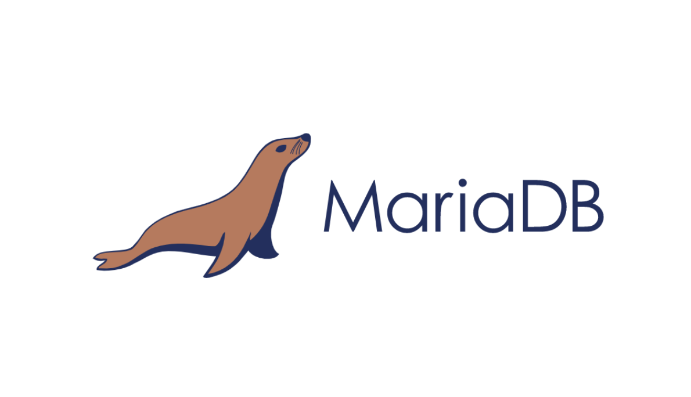
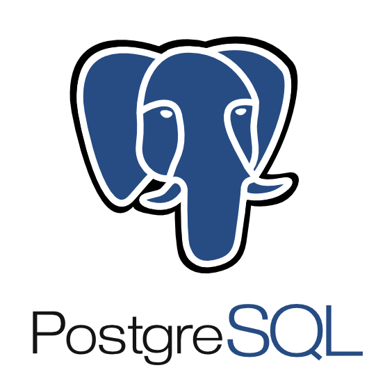

# DBMS 선정 과정 및 기준

## 1. 개요

### 1.1 소개

---

관계형 데이터베이스 시스템을 사용하기로 결정했다면 어떤 DBMS를 사용해야 할까? `MySQL`, `Oracle`, `MS-SQL`, `MariaDB`, `PostgreSQL` 등 세간에는 다양한 RDBMS 제품이 존재한다. 각 제품들 모두 각기 다른 장단점을 가지고 있으며, 위에서 언급한 데이터베이스 모두 '2024년 세계에서 가장 인기있는 DBMS 탑10' 안에 위치하는 제품들이다. 그렇다면 끊임없이 변하는 데이터베이스 시장에서 어떤 기준으로 DB를 선택해야 할 지 알아보도록 하자.

 

 

### 1.2 고민

---

인맥사무소 프로젝트에서 팀원들과 데이터베이스 선정에 대해 다음과 같은 논의를 거쳤다. 

 

 

최종적인 후보로 `MySQL`, `PostgreSQL`, `MariaDB`가 거론되었다. 먼저 우리 서비스는 복잡한 쿼리를 사용하는 기능보다 단순 조회 기능이 주이기 때문에 단순 조회 기능이 조금은 더 우세한 `MySQL`과 `MariaDB` 중에서 선택하기로 했다.

 

 

전체적인 성능상으로는 `MariaDB`가 조금 더 우세했지만, 적은 레퍼런스와 팀원들의 익숙함을 정도를 이유로 `MySQL`을 선택하기로 했다.

## 2. 선정 기준

이러한 논의를 바탕으로 데이터베이스를 선정하였지만, 조금 더 정형화된 선정 기준이 있으면 좋을 것 같다는 생각을 하게 되었다. 다음은 오라클의 한 DBA가 제시한 데이터베이스 선정 기준을 간단하게 정리한 내용이다.

### 2.1 비용

---

실제 서비스를 운영할 때 결국 가장 먼저 고려해야 할 사항은 비용일 것이라 생각한다. 데이터베이스 구축 및 운영에 소요되는 비용은 다음과 같은 기준을 바탕으로 고려할 수 있다.

* 오픈 소스 또는 라이선스가 필요한 데이터베이스 기술인가?
* 현재 데이터베이스 서버를 확장하는 데 드는 비용은 얼마인가?
* 구독료, 사용료 등 제품 비용은 얼마인가?

### 2.2 서비스 수준 협약(SLA)

---

해당 개념은 데이터베이스 복구, 즉 백업과 연관이 있는 개념이다. 목표한 시간 내에 데이터 복구를 진행할 수 있는 정도를 나타내는 지표와 연관이 있다. 사실 정확한 이해가 어려워 조금 더 알아보아야할 항목인 것 같다.

* 다중 노드 클러스터 지원을 제공하는가?
* 재해 복구 솔루션이 있는가?
* 백업에서 고객 데이터를 복원하는 데 걸리는 시간은 얼마나 되는가?

### 2.3 서드파티와의 호환성

---

데이터베이스 중 특정 클라우드나 운영체제에서만 지원하는 제품이 있다. 또 어떤 경우 특정 언어는 지원을 하지 않는 데이터베이스도 있다. 이러한 점을 염두하여 현재 사용중인 서비스의 스택과 호환성을 고려해서 데이터베이스를 결정해야 한다.

* Linux, Windows 등 여러 운영 체제 지원이 필요한가?
* AWS, Google, Microsoft 등 주요 클라우드 공급업체의 지원을 받아야 하는가?
* SQL 언어 지원이 필요한가?
* Java, C, C++, Python 등의 프로그래밍 언어를 지원해야 하는가?
* XML, JSON, 공간 데이터 및 비정형 데이터 지원이 필요한가?

### 2.4 데이터 모델

---

같은 관계형 데이터베이스라고 해도 제품마다 제공하는 데이터 모델이 모두 일치하지는 않는다. 엔티티 간의 연관관계, 정규화 필요성, 쿼리 복잡도 등 특정 데이터 모델링 기능에 특화된 데이터베이스가 있다.

* ACID 지원이 필요한가?
* 제한된 쿼리 패턴이 필요한가?
* 복잡한 쿼리, 저장 프로시저, 뷰가 없는가?
* 데이터베이스의 정규화가 필요한가?
* 데이터 모델을 확장하는 것이 쉬운가?
* 단일 큰 테이블 모델이 필요한가?
* Create, Read, Update, Delete(CRUD) 작업 지원이 필요한가?
* 서로 다른 엔터티 간의 관계 정도는 어떠한가?

### 2.5 복제, 쿼리 성능

---

데이터베이스의 복제 또는 쿼리 성능은 서비스의 사용자 경험과 직결된 부분으로 제품마다 성능 특성을 고려하여 서비스의 성격에 맞는 제품을 선택해야 한다. 다음과 같은 사항을 고려할 수 있다.

* 데이터를 파티셔닝할 수 있는가?
* 복제 방법은 Master-Master 또는 Master-Slave 중 어떤 것을 사용할 것인가?
* 인메모리 기능이 있는가?
* 분석 기능이 필요한가?
* 대량의 데이터를 읽기 모드로만 분석해야 하는가?
* 분산 컴퓨팅 및 저장이 필요한가?
* 복잡한 동적 쿼리에 저장 프로시저나 뷰가 필요한가?

### 2.6 보안

---

보안에 민감한 데이터를 다룰 경우 강력한 보안 기능을 지원하는 데이터베이스를 선택해야 한다. 해당 경우 다음과 같은 사항들을 고려할 수 있다.

* SSL 또는 암호화 프로토콜을 사용하여 데이터베이스와의 안전한 클라이언트 통신이 필요한가?
* 민감한 데이터를 암호화된 형태로 저장해야 하는가?
* 보안 정책에 따라 사용자, 그룹 및 역할에 대한 접근 권한이 필요한가?
* 객체/테이블 수준, 기능 수준 및 필드 수준에서 접근 권한을 제어할 수 있는 기술이 필요한가?
* 단일 로그인, 이중 인증 기능을 통해 인증된 사용자만 접근할 수 있도록 보장할 수 있는가?

### 2.7 사용성

---

버그 패치, 문서화, 커뮤니티 등 사용하기에 편리한 데이터베이스인지를 판단하는 기준이 사용성이다. 아무리 좋은 제품이어도 사용성이 떨어진다면 서비스에 적용하기 어렵다. 다음과 같은 사항들을 고려할 수 있다.

* 구현 과정이 간단한가 아니면 일정 수준의 전문 지식이 필요한가? (Learning curve)
* 데이터베이스 기술의 사용자 및 파트너 커뮤니티가 얼마나 강력하고 연결되어 있는가?
* 데이터베이스 기술의 문제 해결이나 구현 개선에 도움을 줄 수 있는 정보가 얼마나 널리 제공되는가?
* 버그와 관련된 패치가 얼마나 자주 배포되는가?

## 3. MySQL vs MariaDB vs PostgreSQL

> 위 기준들을 중점으로 앞서 우리 팀에서 고민했던 `MySQL`, `MariaDB`, `PostgreSQL`의 특징에 대해 알아보고자 한다.

### 3.1 MySQL

---

 

 

**구독료, 사용료 등 제품 비용은 얼마인가?**

MySQL 커뮤니티 에디션은 무료로 다운로드가 가능하다. 물론, 엔터프라이즈나 클러스터 목적으로 더 많은 기능을 제공하는 유료 버전도 있기는 하지만 소규모 프로젝트에서는 무료 버전으로도 시작하고 추후 확장하는 편이 이득이다.

**오픈 소스 또는 라이선스가 필요한 데이터베이스 기술인가?**

MySQL은 일부 오픈 소스 기능을 제공하지만, 대부분은 오라클의 라이선스 하에 있다. 완전한 오픈 소스 지원이 있을 경우, 특정 문제에 대한 구현과 커뮤니티 지원을 기대할 수 있지만, 소프트웨어가 기업 소유일 경우 지원을 받으려면 비용을 지불해야 한다.

**구현 과정이 간단한가 아니면 일정 수준의 전문 지식이 필요한가? (Learning curve)**

MySQL의 구조와 스타일은 매우 단순하다. 개발자들은 MySQL을 사람처럼 이해하기 쉬운 언어를 가진 데이터베이스로 간주하고는 한다. 또한 대부분의 작업을 명령줄에서 바로 실행할 수 있어 개발 단계를 줄일 수 있다.

**서드파티와의 호환성**

SQL은 특정 표준을 가지고 있지만, MySQL은 이를 완전히 따르지 않는다. 작은 웹 애플리케이션에서는 큰 문제가 되지 않지만, 서비스 규모가 커지게 되어 데이터베이스 이전 시 문제가 발생할 수 있다.

### 3.2 MariaDB

---

 

 

**보안**

MariaDB는 오픈 소스임에도 강력한 보안 기능을 제공한다. 내부 보안 및 비밀번호 검사를 비롯하여, PAM 및 LDAP 인증, Kerberos, 사용자 역할 등 다양한 보안 기능을 제공한다. 또한, 암호화된 테이블스페이스, 테이블 및 로그를 통해 강력한 데이터 보호 계층을 형성한다. MariaDB는 각 보안 업데이트에 대해 관련 릴리스를 공개하여 보안 패치를 투명하게 공개한다.

**다양한 기능**

최근 몇 년간 MariaDB는 많은 새로운 기능을 도입했다. 예를 들어, GIS 지원을 통해 좌표 저장 및 위치 데이터 쿼리를 원활하게 처리할 수도 있고, 동적 열(Dynamic Columns)을 사용하면 단일 DBMS에서 SQL과 NoSQL 데이터 처리를 모두 제공할 수 있다.

**MySQL보다 우수한 쿼리 성능**

MariaDB는 MySQL 엔진에서 유래했지만, 성능 면에서는 더 나은 모습을 보이기도 한다.예를 들어, 테이블에서 행이 삭제되면 운영 체제가 즉시 여유 공간에 접근하여 테이블스페이스의 간격을 제거한다. 또한, 엔진에 독립적인 테이블 통계를 제공하여 옵티마이저의 성능을 향상시키고, 쿼리 처리 속도를 높이며, 데이터 분석을 맞춤화할 수 있게 하기도 한다.

**아직 성장 중인 커뮤니티**

MariaDB는 오픈 소스 기여를 받고 있지만, 커뮤니티는 아직 더 성장해야 할 부분이 많다. 비교적 최근에 만들어졌기 때문에 관련 전문가 수가 MySQL에 비해 상대적으로 적다.

**MySQL과 MariaDB 간의 호환성 문제**

MariaDB 팀이 MySQL의 코드와 끊임없이 병합 작업을 진행하고 있지만, 이 둘의 기능을 동일하게 유지하는 것이 점점 더 어려워지고 있다고 한다. 또한, 최근 들어 MySQL 엔지니어들은 상용 MySQL 사용자에게만 제공되는 고유 기능을 도입했으며, 이는 MariaDB에서 MySQL로의 데이터 마이그레이션 문제나 호환성 문제를 초래할 수 있다.

### 3.3 PostgreSQL

---

 

 

**복잡한 데이터 모델 구축 가능**

객체 관계형 DBMS로, 즉 ORDBMS라고도 하는 PostgreSQL은 사용자 정의 객체와 테이블 방식을 결합하여 복잡한 데이터 구조를 구축할 수 있다. ORDBMS는 다음과 같은 특징이 있다.

* 데이터 모델링 유연성: ORDBMS는 배열, 집합, 객체와 같은 복잡한 데이터 유형을 사용할 수 있게 하여 데이터 모델링에 더 많은 유연성을 제공.
* 상속: ORDBMS는 상속을 지원하여 개발자가 객체의 클래스와 하위 클래스를 정의할 수 있게 함으로써 데이터 구성을 개선하고 중복성을 줄임.
* 성능 향상: ORDBMS는 특정 유형의 데이터에 대해 쿼리를 최적화하고 조인 및 기타 복잡한 작업의 필요성을 줄여 성능을 향상시킬 수 있음.
* 확장성: ORDBMS는 사용자 지정 데이터 유형, 기능 및 연산자를 정의하고 관리하기 위한 프레임워크를 제공하므로 데이터베이스의 기능을 쉽게 확장할 수 있음.
* 객체 지향 프로그래밍과의 통합: ORDBMS는 객체 지향 프로그래밍 언어와의 자연스러운 통합을 제공하여 개발자가 데이터베이스에서 직접 객체를 저장하고 검색할 수 있도록 함.

**커스텀 데이터 타입 지원**

PostgreSQL은 기본적으로 JSON, XML, H-Store 등 다양한 데이터 타입을 네이티브로 지원하며 NoSQL 기능 지원을 제공하는 몇 안 되는 관계형 데이터베이스 중 하나이다. 또한, 사용자가 직접 데이터 타입을 정의할 수도 있다.

**오픈 소스 및 커뮤니티 지원**

PostgreSQL은 완전 오픈 소스 커뮤니티의 지원을 받는다. 따라서 사용자들은 항상 무료로 신속한 커뮤니티 지원을 받을 수 있을 것으로 기대한다. 하지만 아직은 미흡한 점이 많다고 한다.

**일관성 없는 문서화**

PostgreSQL은 큰 커뮤니티를 보유하고 있지만, 문서화가 일관성이나 완성도가 부족한 경우가 많다. PostgreSQL 커뮤니티는 다소 분산되어 있기 때문에, PostgreSQL의 모든 기능에 대해 일관된 표준을 따르지 않는 문제점이 존재한다.

**모니터링 도구의 부족**

PostgreSQL의 큰 단점 중 하나는 현재 데이터베이스 상태를 보여주는 모니터링 도구의 부재다. 문제가 발생하면 이를 지속적으로 확인해야 하는 번거로움이 존재한다.

## 참조

* https://www.linkedin.com/pulse/database-selection-criteria-sunny-kichloo/
* https://www.altexsoft.com/blog/comparing-database-management-systems-mysql-postgresql-mssql-server-mongodb-elasticsearch-and-others/

