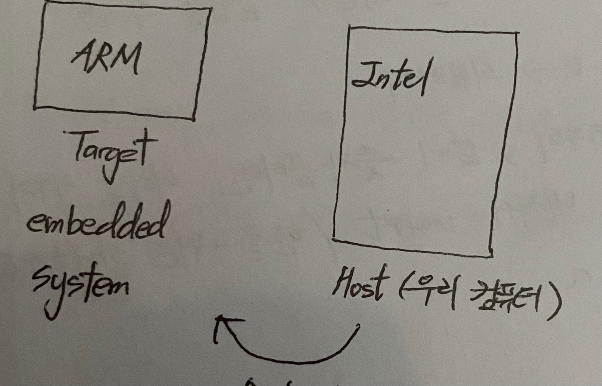
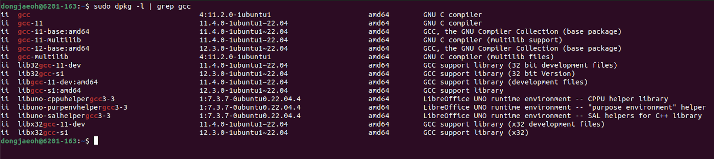
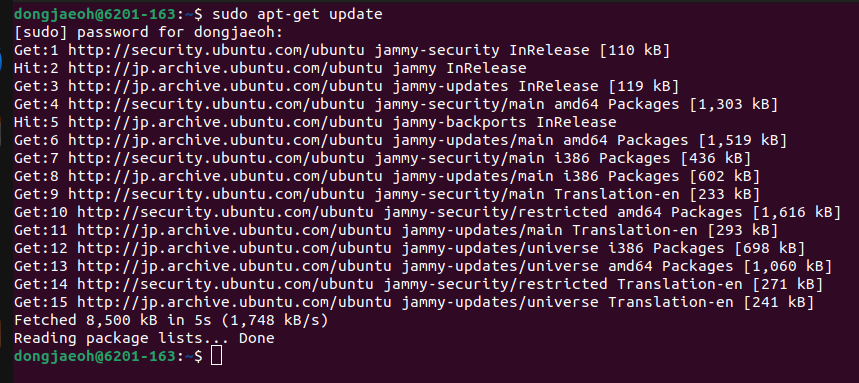
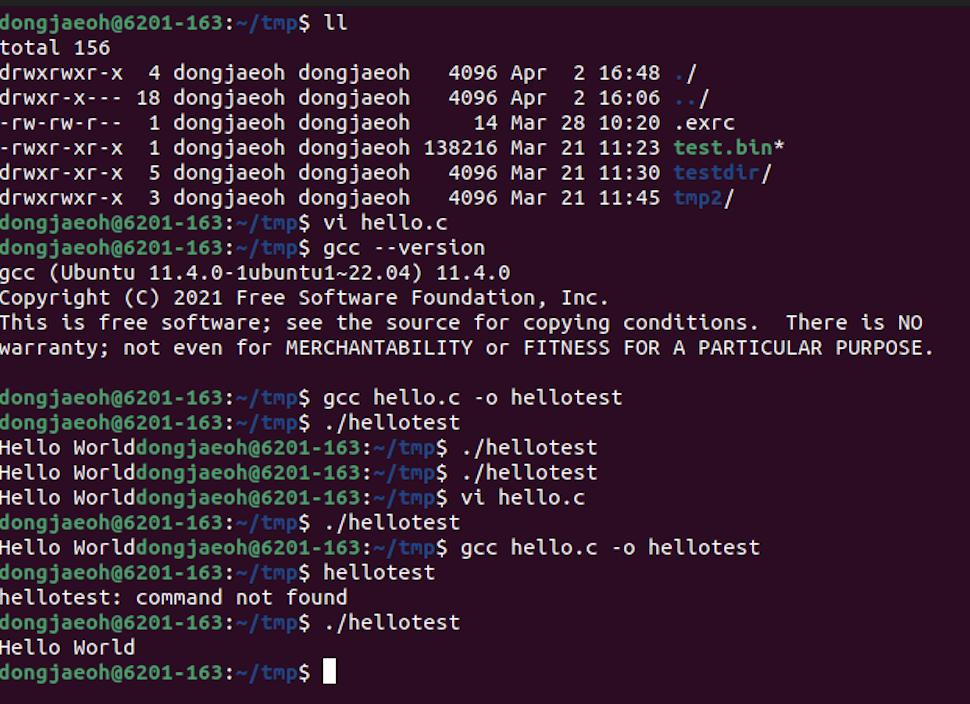
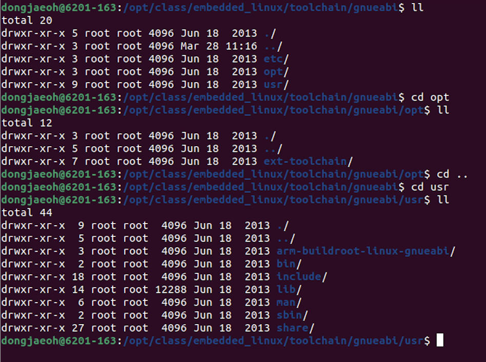
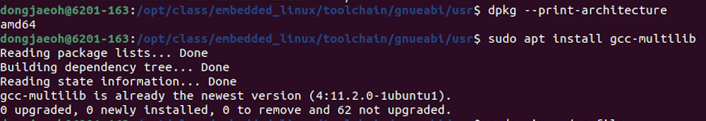
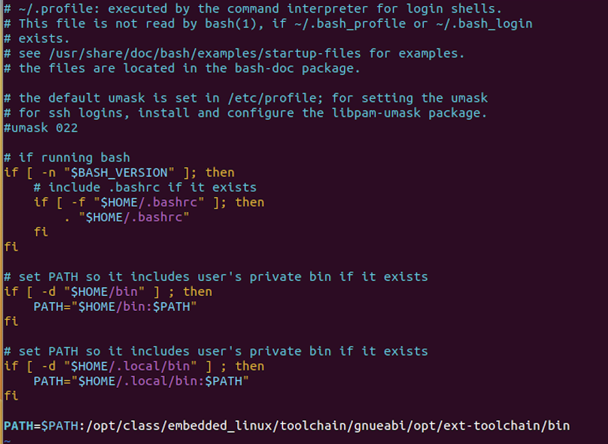

# Cross compiler

### 시스템 구성 필요조건

---

#### Boot Loader

운영체제가 커널영역에 올바르게 적재되기 위해 필요한 프로그램으로 시스템 동작 초기의 부팅을 담당한다.

#### Kernel

커널은 운영체제를 의미하는 단어로 프로세스에 자원을 공정하게 배분하고 시스템의 동작을 제어한다.

#### File System

SSD와 같은 보조기억장치에 위치하는 데이터를 효율적으로 관리하는 조직과 체계를 의미한다.

### 임베디드 시스템 구성

---

#### 개요

ARM 기반의 CPU에서 동작하는 Embedded Linux System(Target)을 개발하기 위해서는 Intel 기반의 리눅스 운영체제(Host)에서 해당 시스템을 개발해야 한다. 즉 Compiler는 Intel 기반의 CPU에서 동작하지만 해당 Compiler가 생성하는 Binary Code는 ARM 기반의 CPU에서 동작해야 한다. 이러한 Compiler를 Cross-Compiler라고 지칭한다.

<br>



<br>

### 임베디드 리눅스 개발을 위한 Compiler

---

#### gcc

gcc는 native compiler이기도 하지만 동시에 다양한 CPU architecure에 대한 cross compile을 지원하기도 한다. 하지만 해당 architecture 규격에 맞는 프로그램을 만들기 위해서는 gnueabi와 armeabi 등의 규격을 따르는 코드가 필요하다.

> ✅ platform이 다르다는 의미는 binary 코드의 실행이 다르다는 의미로, 결국 CPU와 OS가 다르다는 의미이다.

#### gcc 설치 과정

우선 Host 컴퓨터에 gcc를 설치해야 한다. Ubuntu의 APT를 사용하여 gcc 관련 패키지를 다운 받는다. Linux 배포판에는 Debian 계열의 배포판과 Red Hat 계열의 배포판이 있다. Ubuntu는 Debian 계열로서 dpkg 패키지 관리 시스템을 기반으로 apt 명령어를 사용한다. 반면 Fedora 등의 Red Hat 계열은 rpm 기반의 패키지 관리 시스템 사용함으로서 yum 명령어를 통해 패키지를 관리한다. 다음 명령어를 통해 설치된 모든 패키지를 나열한다.

```shell
sudo dpkg -l | grepp gcc
```

<br>



<br>

gcc 관련 패키지가 설치되지 않았다면 `sudo apt-get update` 이후 `sudo apt-get install gcc`를 통해 gcc를 설치한다.

<br>



<br>

gcc는 임베디드 개발 과정에 필요한 C와 어셈블리 언어 등과 같은 언어 뿐만 아니라 C++, Fortran 같은 다양한 언어의 컴파일을 지원한다. 

- 우선 컴파일 테스트를 위해 적당한 폴더에 `vim hello.c` 명령어를 통해 c 코드를 작성한다.
- 해당 코드를 컴파일하기 위해서는 다음 명령어를 작성한다. `gcc -o hellotest hello.c`
- 이제 컴파일된 프로그램을 실행하기 위해 `./hellotest`를 입력한다.

<br>



<br>

#### gnueabi 와 armnoneabi

현재 가동하고자 하는 임베디드 시스템을 위한 소프트웨어(boot loader, kernel, file system)을 크로스 컴파일하기 위해서는 gcc 외에도 **인터페이스 규격에 대한 정보를 제공하는 eabi**가 필요하다. 지난 시간까지 gcc와 gnueabi를 설치하였고 이번 시간에는 armnoneabi를 설치해 보고자 한다.


### gnueabi 설치 과정

---

- `HSmart4412TKU_v201505.tar.gz` 을 압축 해제 하여 ARM용 크로스 컴파일 툴체인을 설치한다.
- 압축을 해제 하기 전 해당 압축 파일이 목적 폴더를 생성하는지 여부를 확인하기 위해 `tar ztvf HSmart4412TKU_v201505.tar.gz` 명령어를 입력한다.
- 해당 압축 파일은 목적 폴더를 생성하므로 `tar zxvf HSmart4412TKU_v201505.tar.gz` 명령어를 사용하여 압축을 정상 해제한다.
- `/opt/class/embedded_linux/toolchain/gnueabi` 경로에 ARM 아키텍쳐용 크로스 컴파일러와 관련된 파일과 디렉토리 등을 위치시킨다.

<br>



<br>

- gnueabi는 32bit 전용 컴파일러이기 때문에 64bit 현재 호스트 플랫폼에서는 원활히 작동하지 않는다. 따라서 32bit 플랫폼을 따로 설치해 주어야 한다.
- `dpkg --print-architecture` 를 터미널에 입력하여 현재 시스템의 플랫폼을 확인하여 준다.
- `dpkg --print-foreign-architectures`를 입력하여 설치 가능한 플랫폼을 확인하여 준다.
- `sudo apt install gcc-multilib`를 입력하여 32bit 플랫폼을 설치하여 준다.

<br>



<br>

gnueabi를 설치하고 ~/.profile 위치에 PATH를 설정해야한다. 터미널 어디에서나 크로스 컴파일러의 바이너리를 찾아 실행할 수 있게끔하기 위함이다.

<br>



<br>

### armnoneabi 설치 과정

---

#### arm-2010q1-188-arm-none-eabi.bin.gz 압축 해제 및 실행

파일을 원하는 위치로 이동시킨 후 `gunzip arm-2010q1-188-arm-none-eabi.bin.gz` 명령어를 통해 해당 파일의 압축을 해제한다. 

압축 해제를 완료하였으면 다음과 같이 `chmod a+x ~.bin`을 통해 user, group, other 모두에게 실행 권한을 부여하고 실행한다.


#### 실행 과정상 발생하는 문제
명령어를 실행해 보면 정상적으로 실행되지 않고 절차상 몇 가지 문제를 마주하게 된다.

##### 1. Bash Shell 문제

`ls l /bin/sh` 명령어를 통해 현재 실제 bash shell이 가리키는 프로그램을 확인할 수 있다. `/bin/sh -> dash*` 과 같은 결과를 보인다면 dash가 아닌 bash 프로그램을 가리키도록 전환해야 한다.


##### 2. /lib/libc.so.6 파일이 없다는 오류

`sudo ln -s /lib/x86_64-linux-gnu/libc.so.6 libc.so.6` 입력을 통해 링크 파일을 생성하여 `libc.so.6` 파일이 `/lib/x86_64-linux-gnu`를 가리키도록 설정한다.


##### 3. libxext.so.6 파일이 없다는 오류

다시 hello.c의 컴파일을 시도해 보면 libxext.so.6의 파일이 없다는 오류가 발생한다. 

`apt-file search libxext.so.6` 명령어를 통해 포함된 패키지를 확인하고 32bit 용 `libxext6:i386` 을 다운 받는다. 

> ✅ **apt-file search 파일명**
특정 파일이 없다는 오류가 발생했을 때 해당 명령어를 사용하면 찾고자 하는 파일이 포함된 패키지 목록을 출력해 준다. 이를 통해 원하는 패키지를 다운 받을 수 있다. apt-file 패키지의 설치 명령은 `sudo apt-get -y install apt-file` 이다.


이후 GUI 창이 등장하며 이어서 진행해 준다. 설치하고자 하는 위치를 다음과 같이 지정해준다.


정상적으로 설치된 모습을 확인할 수 있다.


#### 4. hello.c 컴파일 과정상 문제
`hello.c` 파일을 `arm-linux-gnueabihf-gcc -o hello_arm hello.c` 명령어를 통해 cross compile 시도한다. 하지만 해당 명령어를 실행해 보면 정상적으로 컴파일되지 않고 `libz.so.1` 파일이 없다는 문제를 마주하게 된다. 이 또한 위와 같은 방식으로 `apt-file` 명령어를 통해 필요한 패키지를 설치한다.


### 여러 종류의 gcc cross compiler가 필요한 이유

---

#### Naming Convention: arch-vendor-(os)-abi

gcc cross compiler의 이름에는 명명 규칙이 존재한다. `아키텍쳐-벤더(최종 공급자)-운영체제-abi`형식으로 이름을 짓는다. 앞으로 사용할 컴파일러 또한 `arm-none-eabi`와 `arm-linux-gnueabi` 두 가지 종류의 컴파일러를 사용하게 되는데 이는 최종 개발할 BSP의 동작 방식과 관련이 있다.

#### arm-none-eabi vs arm-linux-gnueabi

Boot Loader와 Kernel은 운영체제와 상관없이 동작하는 raw binary code인 반면에 File System은 리눅스라는 운영체제 위에서 동작하는 프로그램이다. 따라서 Boot Loader와 Kernel은 `arm-none-eabi`를 이용하여 컴파일하고 File System은 `arm-linux-gnueabi`를 사용하여 컴파일한다.


### Ubuntu Linux와 임베디드 키트 연결

---

#### Connection 종류

앞으로 Host(Ubuntu Linux)와 Target(Embedded Kit)를 연결하기 위해 총 3가지 종류의 Connection을 맺게 된다. 첫 번째는 **Serial 연결**, 두 번째는 **USB 연결**, 마지막으로 **Ethernet 연결**이다.


#### Serial 연결

해당 연결을 진행하면 임베디드 키트의 상태를 Host에서 console 화면을 통해 확인할 수 있다. 이를 위해서 minicom 패키지를 다운 받아야 한다.

필요한 설정을 마치고 나면 이를 활용하여 Kernel이 적재되기 직전의 상황인 부트로더에 진입할 수 있다. 단 부팅될 때 3초 안에 엔터를 눌러야 하고 종료할 때도 `ctrl-AX`를 입력해야 종료할 수 있다.
