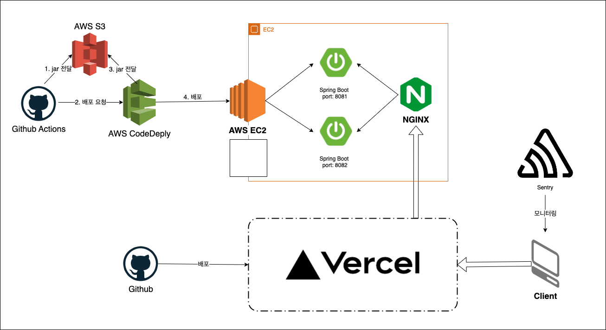

# 캡스톤 자랑 동영상 내용

## 1. 개요

 

`맛있는 재고` 팀에서 **로그인 기능**과 **서버 구축**을 담당했습니다. 주요 기술 구현 내용은 다음과 같습니다.

* `Double Submit Cookie Pattern`을 이용한 `CSRF` 공격 방지
* `spring-security-oauth2-client` 없이 `일반`, `Google`, `Naver`, `Kakao` 로그인 구현
* `AWS CodeDeploy`와 `Nginx`를 활용한 무중단 배포 환경 구축(`Shell Script` 작성)

 

## 2. `Double Submit Cookie Pattern`을 이용한 `CSRF` 공격 방지

### 2.1 기존 방식의 문제점

---

 

웹에서 인증 인가 기능 구현에는 주로 **세션 인증 방식**과 **JWT 토큰** 인증 방식 중 하나가 활용됩니다. 서버와 클라이언트 앱을 따로 구현할 경우 대부분의 프로젝트에서는 JWT 토큰을 웹의 Local Storage에 저장해두었다가 인증이 필요한 요청마다 Header에 토큰을 추가하여 서버에서 이를 파싱하는 작업을 통해 인증 기능을 구현합니다.

하지만 **Local Storage를 사용하여 토큰을 보관할 경우 XSS 공격에 노출될 위험이 크기 때문에** 토큰 안정성을 보장할 수 없습니다. 반면 Cookie를 활용할 경우 httpOnly 옵션을 사용하면 http 통신상에서만 쿠키가 사용되어 Javascript 코드를 통한 접근을 막아 XSS 공격으로부터 토큰을 보호할 수 있으며, secure 옵션을 사용하면 https 통신에서만 쿠키를 전송하게 되어 보안을 더 강화할 수 있습니다.

> ✅ 물론 `Spring Security`에서도 `CSRF` 공격에 대한 방지 기능을 제공해주지만 이는 `Thymeleaf`를 활용한 웹 서버 프로그래밍에서만 유효합니다. 

 

### 2.2 조건

---

 

Spring Boot 앱과 React 앱 간에 쿠키 통신을 허용하려면 다음과 같은 조건들을 충족해야 합니다.

1. HTTP 요청 헤더 `Access-Control-Allow-Credentials`가 `true`
2. Cookie의 `Same Site` 속성 `none`
3. 2번을 만족하기 위해서는 HTTPS로만 통신해야 함

 

### 2.3 구조

---

 

 

1. React 앱이 새롭게 실행될 때마다 서버에서 같은 내용의 CSRF 토큰을 쿠키로 한 번, `message body`로 한 번 발급
2. CSRF 공격에 대한 보호가 필요한 API 요청(`POST`, `PUT`, `PATCH`, `DELETE` 등) 시 앞서 발급 받은 토큰의 내용을 `X-CSRF-TOKEN` 이라는 이름의 헤더에 추가하여 요청
3. Spring Boot에서 요청을 받으면 `Servlet Filter`에서 쿠키의 CSRF 토큰 값과 헤더의 `X-CSRF-TOKEN` 값을 비교하여 허용된 출처의 요청인지 확인

 

## 3. `일반`, `Google`, `Naver`, `Kakao` 로그인 확장된 구조로 구현

### 3.1 구현 기능

---

`spring-security-oauth2-client`를 사용하지 않은 이유는 서비스마다 다른 **토큰 갱신**과 **연동 해제 요청** 그리고 일반 계정과의 연동 때문입니다. 하지만 대부분의 클래스는 해당 라이브러리를 참고하여 구축했습니다.

1. 일반, 구글, 카카오, 네이버로 서비스 회원 가입 가능
2. 일반 계정으로 회원가입 시 각 소셜 로그인 계정과 연동 가능

 

 

### 3.2 구조

---

먼저 다음과 같이 Spring Boot 앱이 실행되면 각각의 소셜 로그인 정보들을 `ClientRegistration` 형태의 객체로 변환하여 `ClientRegistrationRepository`라는 이름의 Bean에 저장합니다.

 

 

해당 경로로 클라이언트가 서버로 GET 요청 시 서버는 provider(google, kakao, naver)에 해당하는 로그인 페이지 URL로 redirect 합니다. 다음 그림에서 1번과 2번에 해당하는 부분입니다.

 

 

해당 provider에 따라 다른 URL로 redirect 해야 하는데, 이 부분을 처리하는 클래스 다이어그램은 다음과 같습니다. Factory Pattern을 이용해서 각각의 다른 provider(registrationId)에 대해 OAuth2Service를 상속받는 각각의 다른 Service 객체를 생성하여 반환합니다. 이는 **연동 해제 기능** 때문입니다.

 

 

그 다음 3번에 해당하는 부분에서 인가 코드와 함께 개발자 센터에 등록한 서버의 URI로 리다이렉트 되면 토큰을 발급 받고 이를 통해 소셜 정보(UserInfo)를 받으면 해당 정보를 가지고 다음과 같은 경우의 수로 처리를 진행합니다.

* 처음 로그인 하는 경우
  * 중복된 이메일의 유저 정보가 있을 경우 로그인 처리 진행
  * 없을 경우 회원가입 진행
* 이미 로그인 되어 있는 상황에서 소셜 로그인으로 요청할 경우(계정 연동하기)
  * 계정 연동 진행

UserInfo의 경우 역시 각각의 소셜 서비스마다 반환값이 다르기 때문에 이를 처리할 수 있도록 FactoryPattern을 사용합니다.

 

생성되는 User 테이블의 정보는 다음과 같습니다. 권한 역시 JPA의 `@ElementCollection`과 `@CollectionTable` 어노테이션을 활용하여 새로운 테이블로 관리하여 줍니다.

 

 

## 4. `AWS CodeDeploy`와 `Nginx`를 활용한 무중단 배포 환경 구축(`Shell Script` 작성)

운영중인 서비스의 코드를 수정하고 프로젝트를 다시 빌드하는 과정의 가장 큰 문제점은 새로운 Jar가 실행되기 전까지 기존 Jar를 종료하는 사이에 발생하는 서비스 중단입니다.

 

구조는 다음과 같습니다. 먼저 하나의 AWS EC2 안에 Nginx 한 대와 2 대의 Jar을 8081 포트와 8082 포트에 나누어 구동합니다.

 

1. 사용자가 서비스 URL로 접속합니다.
2. Nginx가 요청을 받고 연결된 8081 포트의 Spring Boot Jar로 요청을 전달합니다.

 

 

3. 코드 수정 후 다시 빌드된 Jar를 CodeDeploy를 통해 EC2로 전달합니다.
   1. CodeDeploy의 `appspec.yml` 파일은 생명 주기에 맞는 Script 파일을 순서대로 실행합니다.

 

 

4. 가장 먼저 어떤 포트에서 새로운 Jar를 구동할 수 있을 지 찾습니다. 여기서는 8082 포트입니다. (`profile.sh`)
5. 다음으로 8082 포트에서 실행중인 Spring Boot Jar를 종료합니다. (`stop.sh`)
6. 이후 새로운 Jar을 8082포트에서 실행합니다. (`start.sh`)
7. `health.sh`를 통해 8082에서 Jar가 제대로 구동되는지 확인하고 Nginx의 reverse proxy 포트를 8082로 변경합니다.(`switch.sh`)

 

 

코드가 수정되고 새로운 Jar 파일이 배포될 때마다 위 과정이 8081 포트와 8082 포트가 번갈아 가며 교체됩니다. 최종적인 인프라 구조는 다음과 같습니다.

 

 