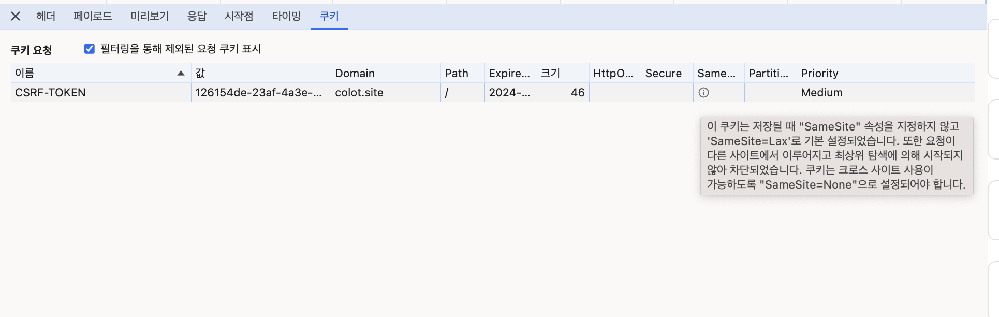

# 쿠키를 통한 CSRF 토큰 발급


### 문제 상황

---

#### 문제

1.  서버로부터 Set-Cookie 헤더로 응답을 전달받아도 브라우저 상에는 Cookie가 저장되지 않는 문제
2. 1번 문제를 해결하여 브라우저 상 Cookie가 저장되어도 해당 Cookie에서 값을 읽어들일 수 없는 문제
3. 클라이언트의 요청 상황에서 서버로 Cookie가 함께 포함되어 전달되지 않는 문제

#### 의도

* JWT 토큰을 이용한 인증 과정을 통해 로그인을 구현하고자 하였다. 해당 과정에서 서버와 클라이언트 간 토큰 전달과 보관은 Cookie를 사용한다.
* Local Storage를 사용하여 토큰을 보관할 경우 XSS 공격에 노출될 위험이 크다는 사실에 기인하여, Access Token을 Local Storage에 저장하고 요청 시 Header에 추가하는 방식에서 벗어나고자 하였다. 
* 반면에 Cookie는 httpOnly 옵션을 사용하면 http 통신상에서만 쿠키가 사용되어 javascript 코드를 통한 접근을 막을 수 있으며, secure 옵션을 사용하면 https 통신에서만 쿠키를 전송하게 되어 보안을 더 강화할 수 있다.

단, 쿠키 또한 CSRF 공격에 노출될 위험이 있기 때문에 CSRF 토큰 발급을 통해 이를 방지할 필요가 있으며 **CSRF 토큰 발급 구현이 Cookie를 통한 Access Token 관리의 핵심이다.** (단, GET, HEAD, TRACE, OPTIONS 요청은 제외)


#### 기존 코드

*Spring*

CookieUtils.java
```java
public class CookieUtils {
    public static Optional<Cookie> getCookie(HttpServletRequest request, String name) {
        ...
    }

    public static void addCookie(HttpServletResponse response, String name, String value, int maxAge) {
        addCookie(response, name, value, false, false, maxAge);
    }

    public static void addCookie(HttpServletResponse response, String name, String value, boolean httpOnly, boolean secure, int maxAge) {
        Cookie cookie = new Cookie(name, value);
        cookie.setPath("/");
        cookie.setHttpOnly(httpOnly);
        cookie.setSecure(secure);
        cookie.setMaxAge(maxAge);
        response.addCookie(cookie);
    }

    public static void deleteCookie(HttpServletRequest request, HttpServletResponse response, String name) {
        ...
    }
}
```

StatelessCSRFFilter.java
```java
@Slf4j
public class StatelessCSRFFilter extends OncePerRequestFilter {
    public static final String CSRF_TOKEN = "CSRF-TOKEN";
    public static final String X_CSRF_TOKEN = "X-CSRF-TOKEN";
    private final RequestMatcher requireCsrfProtectionMatcher = new DefaultRequiresCsrfMatcher();
    private final AccessDeniedHandler accessDeniedHandler = new AccessDeniedHandlerImpl();

    @Override
    protected void doFilterInternal(HttpServletRequest request,
                                    HttpServletResponse response, FilterChain filterChain)
        throws ServletException, IOException {

        if (requireCsrfProtectionMatcher.matches(request)) {
            Optional<String> optCsrfToken = Optional.ofNullable(request.getHeader(X_CSRF_TOKEN));
            Optional<Cookie> optCsrfCookie = CookieUtils.getCookie(request, CSRF_TOKEN);

            log.debug(optCsrfToken.orElse("CSRF 토큰 헤더가 존재하지 않습니다."));
            log.debug(optCsrfCookie.isPresent() ? optCsrfCookie.get().getValue() : "CSRF 쿠키가 존재하지 않습니다.");

            if (optCsrfCookie.isEmpty() || optCsrfToken.isEmpty() || !optCsrfToken.get().equals(optCsrfCookie.get().getValue())) {
                accessDeniedHandler.handle(request, response, new AccessDeniedException("CSRF 토큰이 유효하지 않습니다."));
                return;
            }
        }
        filterChain.doFilter(request, response);
    }

    public static final class DefaultRequiresCsrfMatcher implements RequestMatcher {
        private final Pattern allowedMethods = Pattern.compile("^(GET|HEAD|TRACE|OPTIONS)$");

        @Override
        public boolean matches(HttpServletRequest request) {
            return !allowedMethods.matcher(request.getMethod()).matches();
        }
    }
}
```

AuthenticationController.java
```java
@RestController
@Slf4j
@RequiredArgsConstructor
public class AuthenticationController {
    @GetMapping("/csrf-token")
    public void getCsrfToken(HttpServletRequest request, HttpServletResponse response) {
        generateCSRFTokenCookie(response);
    }

    private void generateCSRFTokenCookie(HttpServletResponse response) {
        CookieUtils.addCookie(response, StatelessCSRFFilter.CSRF_TOKEN, UUID.randomUUID().toString(), 60 * 60 * 24);
    }
}
```

*React*

프론트에서는 React App이 처음 실행되거나 페이지가 변경될 때마다 CSRF 토큰을 요청하여 cookie로 전달받고 저장해 두고자 하였다. 이후 GET, HEAD, TRACE, OPTIONS 메서드를 제외한 모든 요청에서 axios의 인터셉터를 활용하여 저장해 둔 CSRF 토큰으로부터 값을 읽어들여 요청 헤더에 X-CSRF-TOKEN을 설정하고 서버에서 이를 비교하는 과정을 통해 CSRF 공격으로부터 정상적인 요청을 검증한다.

index.js
```javascript
...

axios
  .get('https://colot.site/csrf-token')
  .then(response => {
    const csrfToken = Cookies.get('CSRF-TOKEN')
    console.log('응답의 csrf=' + csrfToken);
    })
  .catch(error => {
    console.error('Error fetching CSRF token:', error);
  });

...

```

axios.js
```javascript
import axios from 'axios';
import Cookies from 'js-cookie';

const instance = axios.create({
  baseURL: 'https://colot.site'
});

instance.interceptors.request.use(config => {
  if (!config.method.toUpperCase().match(/^(GET|HEAD|TRACE|OPTIONS)$/)) {
    const csrfToken = Cookies.get('CSRF-TOKEN');
    if (csrfToken) {
      config.headers['X-CSRF-TOKEN'] = csrfToken;
    } else {
      console.error('CSRF 토큰 쿠키에 없음');
    }
  }
  return config;
});

export default instance;

```

하지만 이 상황에서 다음과 같이 Set-Cookie 헤더는 정상적으로 설정되었음에도 불구하고 애플리케이션 탭을 확인해보면 브라우저 상에는 쿠키가 저장되지 않았음을 확인할 수 있다.

 <br/>


### 해결 방법

---

#### 쿠키 저장 문제 : 'With Credentials: true'

With Credentials 옵션은 단어 그대로, 다른 도메인(Cross Origin)에 요청을 보낼 때 요청에 인증(credential) 정보를 담아서 보낼지를 결정하는 항목이다. 즉, 쿠키나 인증 헤더 정보를 포함시켜 요청하고 싶다면, 클라이언트에서 API 요청 메소드를 보낼때 withCredentials 옵션을 true로 설정해야 한다. 또한 인증된 요청을 정상적으로 수행하기 위해선 클라이언트뿐만 아니라 서버에서도 Access-Control-Allow-Credentials 헤더를 true로 함으로써 인증 옵션을 설정해 주어야 한다.

*React*

axios.js

```javascript
const instance = axios.create({
  baseURL: 'https://colot.site',
  withCredentials: true
});
```

Spring WebMvcConfigurer를 활용하여 CORS 설정을 할 수도 있지만 본인은 Nginx 설정을 통해 WAS로 전달되는 요청에서 Header 값을 설정하였다.

*Nginx*

nginx.conf
```shell
location / { # location 블록
                include /etc/nginx/proxy_params;
                proxy_pass $service_url;        # reverse proxy의 기능
                if ($http_x_forwarded_proto = 'http'){
                        return 308 https://$host$request_uri;
                }

                if ($request_method = 'OPTIONS') {
                        (...생략...)
                        add_header 'Access-Control-Allow-Credentials' 'true';
                        (...생략...)
                        return 204;
                }
                (...생략...)
                add_header 'Access-Control-Allow-Credentials' 'true' always;
                (...생략...)
    }
```

#### 요청에 쿠키가 포함되어 전달되지 않는 문제 : 'SameSite = None'

앞선 문제 해결을 통해 쿠키가 정상 설정되었더다 하더라도 여전히 요청 시에는 쿠키가 포함되지 않았다. 알아본 결과 다른 도메인 간의 쿠키 전달을 허용하기 위해서는 Cookie의 속성 중 **SameSite 속성을 None**으로 설정해 주어야 한다는 사실을 알게 되었다.

 

네트워크 탭에서 쿠키 요청 부분을 보면 작은 알림창으로 SameSite 속성에 다음과 같은 안내문이 표시된 것을 확인할 수 있다. SameSite란 웹 애플리케이션에서 CSRF(교차 사이트 요청 위조) 공격을 방지하기 위해 HTTP 쿠키에서 설정할 수 있는 속성으로 **Strict, Lax, None 셋 중 하나로 설정하여 쿠키가 통신할 수 있는 범위를 제한한다.**

* Strict: 같은 도메인끼리만 쿠키 전송 가능
* Lax: 서로 다른 도메인이라도 GET 요청이나 'a'나 'link' 태그를 통한 쿠키 전송은 허용한다.
* None: 서로 다른 도메인간 쿠키 전달을 허용한다. 단, Secure 옵션을 반드시 true로 설정해 주어야 한다.
  
*Spring*

`jakarta.servlet.http.Cookie;` 클래스에는 SameSite 속성을 설정할 수 없는 메소드가 따로 없기 때문에 setAttribute() 메소드를 통해 직접 설정해 주어야 한다.

CookieUtils.java
```java
public class CookieUtils {
    public static Optional<Cookie> getCookie(HttpServletRequest request, String name) {
        ...
    }

    public static void addCookie(HttpServletResponse response, String name, String value, int maxAge) {
        addCookie(response, name, value, true, true, maxAge);
    }

    public static void addCookie(HttpServletResponse response, String name, String value, boolean httpOnly, boolean secure, int maxAge) {
        Cookie cookie = new Cookie(name, value);
        cookie.setPath("/");
        cookie.setHttpOnly(httpOnly);
        cookie.setSecure(secure);
        cookie.setMaxAge(maxAge);
        cookie.setAttribute("SameSite", "None");
        response.addCookie(cookie);
    }

    public static void deleteCookie(HttpServletRequest request, HttpServletResponse response, String name) {
        ...
    }
}
```


#### 서버로부터 전달받은 쿠키의 값을 읽을 수 없는 문제 : Chrome 정책 변경

다음과 같이 `console.log()`를 통해 쿠키의 값을 읽어들이려 해도 불러들일 수 없는 문제가 있었다.

```javascript
axios
  .get('https://colot.site/csrf-token') // withCredentials를 true로 설정
  .then(response => {
    const csrfToken = Cookies.get('CSRF-TOKEN');
    console.log('쿠키의 csrf=' + csrfToken);
  })
  .catch(error => {
    console.error('Error fetching CSRF token:', error);
  });
```


이러한 문제는 2024년 1월부터 절차적으로 시행 중인 **Chrome의 정책 변경** 때문이었다. 메시지를 다시 읽어보면 다른 도메인으로부터 설정된 쿠키의 값을 읽어 들일 수 없는 원칙이 원인임을 확인할 수 있다.


이에 따른 해결책으로 서버에서 쿠키 전달과 함께 CSRF 토큰에 대한 **응답으로 동일한 토큰의 내용을 message body에 함께 전달하고 해당 토큰 값을 프론트엔드에서 읽어들여 X-CSRF-TOKEN 헤더에 이를 추가하는 방식**을 고안하였다. 결국 CSRF 토큰을 통한 CSRF 공격 방지 방식은 중간에 **공격자는 요청 헤더의 값을 변경할 수 없다는 점**을 이용한 방식이기 때문에 message body에서 값을 불러와 헤더를 설정해도 문제될 소지가 없다고 예상한다.


#### 최종 코드

*React*

index.js

```javascript
...
axios
  .get('https://colot.site/csrf-token', { withCredentials: true }) // withCredentials를 true로 설정
  .then(response => {
    const csrfToken = response.data['CSRF-TOKEN'];
    // console.log('응답의 csrf=' + csrfToken);
    Cookies.set('X-CSRF-TOKEN', csrfToken, {
      secure: true,
    }); // 일시적인 저장을 위해 생성
  })
  .catch(error => {
    console.error('Error fetching CSRF token:', error);
  });
...
```

axios.js

```javascript
import axios from 'axios';
import Cookies from 'js-cookie';

const instance = axios.create({
  baseURL: 'https://colot.site',
  withCredentials: true,
  headers: {
    'Access-Control-Allow-Origin': 'https://colot.site',
  },
});

instance.interceptors.request.use(config => {
  if (!config.method.toUpperCase().match(/^(GET|HEAD|TRACE|OPTIONS)$/)) {
    const csrfToken = Cookies.get('X-CSRF-TOKEN');

    if (csrfToken) {
      config.headers['X-CSRF-TOKEN'] = csrfToken;
    } else {
      console.error('CSRF 토큰 쿠키에 없음');
    }
  }
  return config;
});

export default instance;

```

*Spring*

CookieUtils.java
```java
public class CookieUtils {
    public static Optional<Cookie> getCookie(HttpServletRequest request, String name) {
        ...
    }

    public static void addCookie(HttpServletResponse response, String name, String value, int maxAge) {
        addCookie(response, name, value, true, true, maxAge);
    }

    public static void addCookie(HttpServletResponse response, String name, String value, boolean httpOnly, boolean secure, int maxAge) {
        Cookie cookie = new Cookie(name, value);
        cookie.setPath("/");
        cookie.setHttpOnly(httpOnly);
        cookie.setSecure(secure);
        cookie.setMaxAge(maxAge);
        cookie.setAttribute("SameSite", "None");
        response.addCookie(cookie);
    }

    public static void deleteCookie(HttpServletRequest request, HttpServletResponse response, String name) {
        ...
    }
}
```

StatelessCSRFFilter.java
```java
@Slf4j
public class StatelessCSRFFilter extends OncePerRequestFilter {
    public static final String CSRF_TOKEN = "CSRF-TOKEN";
    public static final String X_CSRF_TOKEN = "X-CSRF-TOKEN";
    private final RequestMatcher requireCsrfProtectionMatcher = new DefaultRequiresCsrfMatcher();

    @Override
    protected void doFilterInternal(HttpServletRequest request, HttpServletResponse response, FilterChain filterChain) throws ServletException, IOException {
        if (requireCsrfProtectionMatcher.matches(request)) {
            try {
                String csrfToken = Optional.ofNullable(request.getHeader(X_CSRF_TOKEN))
                        .orElseThrow(() -> new SecurityException(ErrorCode.CSRF_HEADER_TOKEN_NOT_FOUND_EXCEPTION, ErrorCode.CSRF_HEADER_TOKEN_NOT_FOUND_EXCEPTION.getMessage()));

                Cookie csrfCookie = CookieUtils.getCookie(request, CSRF_TOKEN)
                        .orElseThrow(() -> new SecurityException(ErrorCode.CSRF_COOKIE_TOKEN_NOT_FOUND_EXCEPTION, ErrorCode.CSRF_COOKIE_TOKEN_NOT_FOUND_EXCEPTION.getMessage()));

                if (!csrfToken.equals(csrfCookie.getValue())) {
                    throw new SecurityException(ErrorCode.CSRF_TOKEN_INVALID_EXCEPTION, ErrorCode.CSRF_TOKEN_INVALID_EXCEPTION.getMessage());
                }
            } catch (SecurityException e) {
                log.error("CSRF 토큰이 일치하지 않습니다: {}", e.getMessage(), e);
                setErrorResponse(response, e.getErrorCode());
                return;
            }
        }
        filterChain.doFilter(request, response);
    }

    public static final class DefaultRequiresCsrfMatcher implements RequestMatcher {
        private final Pattern allowedMethods = Pattern.compile("^(GET|HEAD|TRACE|OPTIONS)$");

        @Override
        public boolean matches(HttpServletRequest request) {
            return !allowedMethods.matcher(request.getMethod()).matches();
        }
    }
}
```

AuthenticationController.java
```java
@RestController
@Slf4j
@RequiredArgsConstructor
public class AuthenticationController {
    @GetMapping("/csrf-token")
    public ResponseEntity<?> getCsrfToken(HttpServletRequest request, HttpServletResponse response) {
        String csrfToken = UUID.randomUUID().toString();
        Map<String, String> resMap = new HashMap<>();
        resMap.put(StatelessCSRFFilter.CSRF_TOKEN, csrfToken);
        generateCSRFTokenCookie(response, csrfToken);
        return ResponseEntity.ok(resMap);
    }

    private void generateCSRFTokenCookie(HttpServletResponse response, String csrfToken) {
        CookieUtils.addCookie(response, StatelessCSRFFilter.CSRF_TOKEN, csrfToken, 60 * 60 * 24);
    }
}
```
