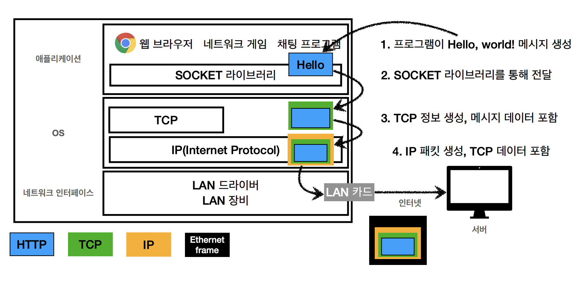
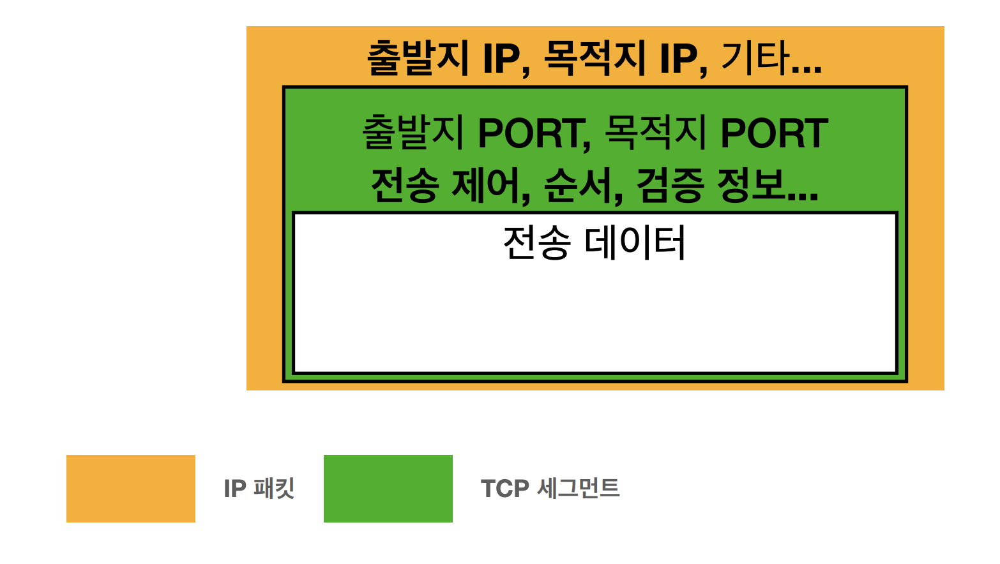

# 네트워크 통신 개요

### 인터넷

---

우선 인터넷과 웹은 동급의 개념이 아니다. 인터넷은 웹이 동작하는 환경이다. **HTTP 웹 통신이란 인터넷이라는 배경 하에 동작하는 통신 규약**을 의미한다. 전 세계 수많은 컴퓨터가 인터넷을 이루는 과정부터 HTTP 프로토콜로 데이터를 통신하는 과정까지 이해할 필요가 있다.

### 서버와 클라이언트

---

컴퓨터가 두 대 존재한다고 가정해 보자. 두 컴퓨터가 통신하기 위해서는 한 쪽의 컴퓨터가 다른 쪽의 컴퓨터에 데이터를 **요청 *request***해야 한다. 그리고 요청받은 컴퓨터는 반대쪽의 컴퓨터로 데이터를 **응답 *response***해야 한다. 이때 데이터를 요청하는 컴퓨터를 고객이라는 의미에서 **클라이언트 *Client***라 하고 데이터를 제공하는 컴퓨터를 공급자라는 의미에서 **서버 *Server***라고 한다. 

예를 들어 서로 주고받는 데이터가 웹 문서일 경우 웹 클라이언트와 웹 서버라 하고, 게임 데이터일 경우에는 게임 클라이언트와 게임 서버라고 하며, 채팅 데이터일 경우에는 채팅 클라이언트와 채팅 서버라 한다.

### 통신 과정

---

데이터의 인터넷상 통신 과정은 크게 4가지의 절차를 거쳐 진행된다. 해당 4가지 계층을 인터넷 프로토콜 스택의 4계층이라고 하는데, 상단에서부터 **애플리케이션 계층(HTTP), 전송계층(TCP, UDP), 인터넷 계층(IP), 네트워크 인터페이스 계층**이라고 부른다.

위 그림과 같이 클라이언트 컴퓨터에서 Hello, World!라는 메시지를 작성한다고 가정해 보자. 데이터가 애플리케이션 계층에서 HTTP 프로토콜(규칙)을 바탕으로 운영체제에 전달이 되면 TCP/IP 프로토콜을 바탕으로 필요한 데이터가 내려온(페이로드) 데이터에 한 차례 더 감싸지고, 이후 LAN선을 거쳐서 서버로 전송이 된다. 해당 서버에서 또한 이 과정을 역순으로 진행하여 전송 받은 데이터를 식별한다.

